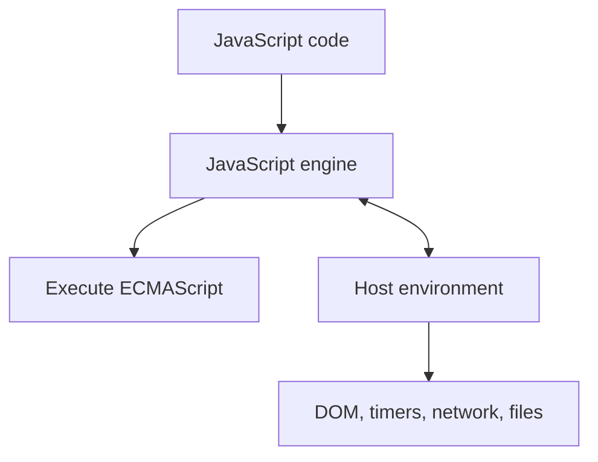

# Lesson 01 — JavaScript Engine and Host Environment

> **Flow:** Learn → Understand → Visualize → Apply → Recall → Master

## Lesson Metadata

| Property | Value |
|---|---|
| Field | JavaScript Runtime Fundamentals |
| Level | Beginner → Intermediate |
| Study time | 30–45 minutes |
| Prerequisites | Basic JavaScript syntax and functions |
| Reference | [MDN Execution Model](https://developer.mozilla.org/en-US/docs/Web/JavaScript/Reference/Execution_model#the_engine_and_the_host) |

## Learning Objectives

After this lesson, you should be able to:

1. Define a JavaScript engine.
2. Define a host environment.
3. Separate ECMAScript features from platform APIs.
4. Explain why browser and Node.js APIs differ.
5. Describe what happens when JavaScript calls a timer or performs I/O.

## Lesson Overview

A practical JavaScript runtime requires cooperation between two systems:

> **JavaScript runtime = JavaScript engine + host environment**

The engine understands and executes JavaScript. The host connects JavaScript to capabilities outside the language.



## Core Terminology

| Term | Meaning |
|---|---|
| ECMAScript | Standard that defines the JavaScript language |
| Engine | Software that parses, optimizes, and executes JavaScript |
| Host environment | Platform providing external APIs and runtime services |
| Host API | Capability supplied by a browser, Node.js, or another host |

## JavaScript Engine

The engine:

- reads and parses source code;
- reports syntax errors;
- compiles or interprets instructions;
- executes expressions and functions;
- manages memory;
- optimizes frequently executed code.

Examples include V8, SpiderMonkey, and JavaScriptCore.

```js
function add(a, b) {
  return a + b;
}

const result = add(10, 20);
```

The engine understands functions, parameters, variables, arithmetic, calls, and returns because they are JavaScript language features.

## Host Environment

The host supplies APIs beyond ECMAScript.

| Browser host | Node.js host |
|---|---|
| `window` and `document` | `process` |
| DOM and UI events | Filesystem APIs |
| Browser networking | HTTP servers and sockets |
| Web Workers | Worker threads |
| Timers | Timers |

This works in a browser:

```js
document.body.style.backgroundColor = "black";
```

It fails in ordinary Node.js because Node.js does not provide the browser DOM.

This works in Node.js:

```js
import { readFile } from "node:fs/promises";

const content = await readFile("notes.txt", "utf8");
```

The browser does not normally provide Node.js filesystem modules.

## Who Owns Each Feature?

| Feature | Owner |
|---|---|
| `function`, `const`, objects | ECMAScript / engine |
| `Promise`, `async`, `await` | ECMAScript / engine |
| `document` and DOM events | Browser host |
| `setTimeout()` | Host environment |
| `fetch()` | Host environment |
| `fs.readFile()` and `process` | Node.js host |

## Execution Walkthrough

```js
console.log("Start");

setTimeout(() => {
  console.log("Timer finished");
}, 1000);

console.log("End");
```

1. The engine prints `Start`.
2. JavaScript asks the host to manage the timer.
3. The engine continues and prints `End`.
4. The host schedules the callback after the timer finishes.
5. The engine executes the callback when the stack is available.

Output:

```text
Start
End
Timer finished
```

## Node.js Architecture Connection

```js
export const getProducts = async (req, res) => {
  const products = await productRepository.findAll();
  res.status(200).json({ data: products });
};
```

The engine executes the function. Node.js receives and sends HTTP data. A driver and host facilities coordinate the database I/O. Promise scheduling later resumes the function.

## Common Mistakes

- **“Node.js is a language.”** Node.js is a JavaScript host environment.
- **“V8 and Node.js are identical.”** V8 is the engine used inside Node.js.
- **“`setTimeout()` is pure ECMAScript.”** It is supplied by the host.
- **“Async work is handled entirely by the engine.”** The engine, host, queues, and event loop cooperate.

## Learning by Doing

Create two files:

1. A browser script that changes DOM content.
2. A Node.js script that reads a text file.

For every API used, label it either `ECMAScript`, `browser host`, or `Node.js host`.

## Active Recall

1. What does the JavaScript engine do?
2. What does the host environment do?
3. Why does `document` fail in Node.js?
4. Who manages `setTimeout()`?
5. Is `Promise` a language feature or browser-only API?

## Memorization Points

- The engine executes JavaScript.
- The host connects JavaScript to the outside world.
- Browsers and Node.js provide different APIs.
- The host manages timers and I/O; the engine executes their JavaScript callbacks.

## Notion Card Summary

The JavaScript engine parses and executes ECMAScript. A host environment such as a browser or Node.js provides external capabilities including the DOM, timers, networking, filesystem access, and server APIs. Practical asynchronous execution requires cooperation between the engine and host.

## Senior Developer Takeaway

Before debugging runtime behavior, identify whether the feature belongs to ECMAScript or the host. Never assume a browser API exists in Node.js, or that scheduling details are identical across environments.

## Final Summary

> **Engine executes. Host provides. Together they form a practical runtime.**

## Completion Checklist

- [ ] I can explain engine versus host without notes.
- [ ] I can classify common APIs correctly.
- [ ] I understand why `document` fails in Node.js.
- [ ] I can explain how a host-managed timer returns to JavaScript.
- [ ] I completed the practical exercise.
