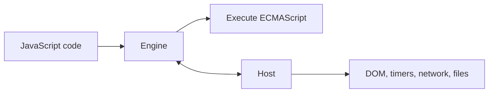

# 01 — JavaScript Engine and Host Environment

<div align="center">


**Learn who executes JavaScript and who connects it to the outside world.**

</div>

## About This Lesson

This lesson establishes the first mental model of JavaScript runtime architecture:

> **JavaScript runtime = JavaScript engine + host environment**

The engine parses and executes ECMAScript. The host provides platform capabilities such as the DOM, timers, networking, files, processes, and servers.

## Learning Objectives

- Define a JavaScript engine and host environment.
- Separate language features from host APIs.
- Compare browser and Node.js capabilities.
- Explain why `document` fails in Node.js.
- Describe how timers and I/O require engine–host cooperation.

## Material Covered

1. ECMAScript and the JavaScript engine
2. V8, SpiderMonkey, and JavaScriptCore
3. Browser host APIs
4. Node.js host APIs
5. Feature ownership
6. Timer execution flow
7. Node.js backend connection
8. Common runtime misconceptions

## Architecture Flow



## Engine vs Host

| JavaScript engine | Host environment |
|---|---|
| Parses JavaScript | Provides platform APIs |
| Executes functions | Manages timers and I/O |
| Manages language memory | Connects to external systems |
| Implements ECMAScript | Implements browser or server capabilities |

## Browser vs Node.js

| Browser | Node.js |
|---|---|
| `window`, `document`, DOM | `process`, filesystem, servers |
| UI events and rendering | Operating-system and network APIs |
| Web Workers | Worker threads |
| Browser networking | Server networking and sockets |

## Key Example

```js
console.log("Start");

setTimeout(() => {
  console.log("Timer finished");
}, 1000);

console.log("End");
```

Output:

```text
Start
End
Timer finished
```

The host manages the timer. The engine continues executing and later executes the scheduled callback.

## Learning Flow

```text
Read concept
→ Classify engine and host responsibilities
→ Trace the timer example
→ Compare browser and Node.js
→ Build two environment-specific examples
→ Explain without notes
```

## Memorization Point

> **The engine executes JavaScript. The host connects JavaScript to the outside world.**

## Senior Developer Takeaway

Before debugging runtime behavior, identify whether a feature belongs to ECMAScript or its host. Never assume that browser and Node.js APIs or scheduling details are identical.

## Mastery Checklist

- [ ] I can explain engine versus host.
- [ ] I can classify common JavaScript APIs.
- [ ] I understand why `document` is unavailable in Node.js.
- [ ] I can explain the timer execution flow.
- [ ] I can connect the model to a Node.js controller.

## Source Material

- [Full lesson document](../01-engine-and-host-environment.md)
- [MDN — Engine and host](https://developer.mozilla.org/en-US/docs/Web/JavaScript/Reference/Execution_model#the_engine_and_the_host)

---

[← Main documentation](../README.md) · [Next lesson →](../02/README.md)
