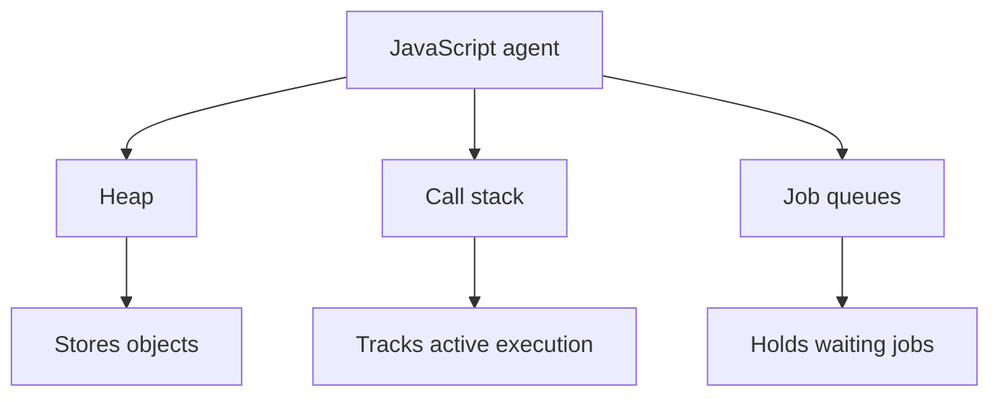

# Lesson 02 — Agent, Heap, Call Stack, and Queue

> **Flow:** Learn → Understand → Visualize → Trace → Build → Recall → Master

## Lesson Metadata

| Property | Value |
|---|---|
| Field | JavaScript Runtime Architecture |
| Level | Beginner → Intermediate |
| Study time | 45–60 minutes |
| Prerequisites | Lesson 01 and JavaScript functions |
| Reference | [MDN Agent Execution Model](https://developer.mozilla.org/en-US/docs/Web/JavaScript/Reference/Execution_model#agent_execution_model) |

## Learning Objectives

After this lesson, you should be able to:

1. Define a JavaScript agent.
2. Explain the heap, call stack, and job queue.
3. Trace function entry and exit order.
4. Explain an execution context at a basic level.
5. Distinguish currently executing code from waiting work.

## Lesson Overview

An **agent** is an autonomous JavaScript executor. Conceptually, an agent owns a heap, call stack, queues, one or more realms, and a memory model.



## Core Terminology

| Term | Meaning |
|---|---|
| Agent | Autonomous executor of JavaScript |
| Heap | Managed memory containing objects and dynamic data |
| Call stack | LIFO structure holding active execution contexts |
| Execution context | Runtime information for executing global or function code |
| Queue | Structure containing jobs waiting to execute |
| LIFO | Last In, First Out |

## Heap

```js
const user = {
  name: "Muaddh",
  role: "Full-Stack Developer",
};
```

The `user` binding refers to an object stored in managed memory commonly represented as the heap.

> **Heap stores objects and allocated data.**

## Call Stack

```js
function multiply(number) {
  return number * 2;
}

function calculate(value) {
  return multiply(value) + 10;
}

const result = calculate(5);
```

Entry order:

```text
Global → calculate() → multiply()
```

Exit order:

```text
multiply() → calculate() → Global
```

At the deepest point:

```text
TOP     multiply(5)
        calculate(5)
BOTTOM  Global execution
```

`multiply()` entered last, so it leaves first.

## Execution Context

Each function call creates an execution context, also called a stack frame. It remembers:

- parameters and local variables;
- the current code position;
- the current `this` value;
- the function or script being executed;
- where control should return.

For `multiply(5)`, the context knows the function is `multiply`, `number` equals `5`, and execution must return to `calculate()`.

## Job Queue

Queues hold future JavaScript work such as timer callbacks, promise reactions, events, or completed I/O callbacks.

```js
setTimeout(() => {
  console.log("Timer");
}, 1000);
```

The callback does not remain on the stack for one second.

```text
Host manages timer
      ↓
Timer finishes
      ↓
Callback enters queue
      ↓
Callback waits for available stack
      ↓
Engine executes callback
```

## Complete Execution Walkthrough

```js
function greet(name) {
  const user = { name };
  return `Hello, ${user.name}`;
}

function start() {
  return greet("Muaddh");
}

setTimeout(() => console.log("Timer"), 0);
console.log(start());
```

1. The host begins managing the timer.
2. `start()` enters the stack.
3. `greet()` enters the stack.
4. The `user` object is created in the heap.
5. `greet()` returns and leaves first.
6. `start()` returns and leaves.
7. The console prints `Hello, Muaddh`.
8. The timer callback later executes and prints `Timer`.

## Stack Overflow

```js
function recurse() {
  recurse();
}

recurse(); // RangeError: Maximum call stack size exceeded
```

Calls keep entering without returning until the stack limit is reached.

## Common Mistakes

- Confusing the heap with the call stack.
- Saying a timer callback remains on the stack while waiting.
- Reversing function entry and exit order.
- Treating the queue as the place where code actively executes.
- Believing one agent means the entire application can never use workers.

## Learning by Doing

Write four nested functions. Before running them:

1. Draw the entry order.
2. Draw the deepest stack state.
3. Draw the exit order.
4. Add an object and label its conceptual storage.
5. Add a timer and explain where its callback waits.

## Active Recall

1. What is an agent?
2. What does the heap store?
3. What does the stack track?
4. What does LIFO mean?
5. Does `first()` or the function it calls enter first?
6. Which function leaves first?
7. Where does a completed timer callback wait?

## Memorization Points

- Heap stores.
- Stack executes.
- Queue waits.
- Function entry follows the calls.
- Function exit reverses the entry order.
- Each function call receives an execution context.

## Notion Card Summary

A JavaScript agent conceptually owns a heap, call stack, and job-processing queues. Objects live in managed memory represented as the heap. Active execution contexts live on the LIFO call stack. Future callbacks wait in queues until the runtime can execute them.

## Senior Developer Takeaway

When diagnosing performance, ask whether data is consuming memory in the heap, synchronous work is occupying the stack, or callbacks are waiting in queues. These are different problems requiring different solutions.

## Final Summary

> **Heap stores. Stack executes. Queue waits.**

## Completion Checklist

- [ ] I can define an agent.
- [ ] I can separate heap, stack, and queue.
- [ ] I can trace function entry and exit correctly.
- [ ] I can explain an execution context.
- [ ] I completed the stack-tracing exercise.
