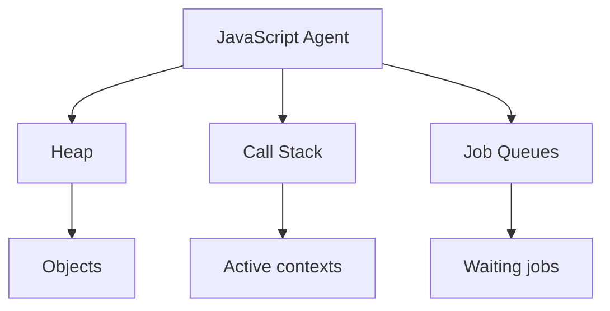

# 02 — Agent, Heap, Call Stack, and Queue

<div align="center">


**Understand where objects live, where functions execute, and where future jobs wait.**

</div>

## About This Lesson

This lesson introduces the JavaScript agent and its three essential runtime structures:

> **Heap stores. Stack executes. Queue waits.**

It also teaches function entry and exit order and introduces execution contexts as stack frames.

## Learning Objectives

- Define a JavaScript agent.
- Distinguish heap, stack, and queue.
- Trace nested function calls.
- Explain LIFO execution.
- Explain what an execution context remembers.
- Locate a completed asynchronous callback before execution.

## Material Covered

1. JavaScript agents
2. Heap memory
3. Call stack
4. LIFO behavior
5. Execution contexts
6. Job queues
7. Timer callback lifecycle
8. Stack overflow

## Runtime Architecture



## Core Structures

| Structure | Responsibility |
|---|---|
| Heap | Stores objects and allocated data |
| Call stack | Tracks currently executing contexts |
| Queue | Holds jobs waiting to execute |

## Stack Example

```js
function multiply(number) {
  return number * 2;
}

function calculate(value) {
  return multiply(value) + 10;
}

const result = calculate(5);
```

Entry order:

```text
Global → calculate() → multiply()
```

Exit order:

```text
multiply() → calculate() → Global
```

At maximum depth:

```text
TOP     multiply(5)
        calculate(5)
BOTTOM  Global
```

## Asynchronous Callback Flow

```text
Host manages operation
→ Operation finishes
→ Callback enters queue
→ Callback waits for available stack
→ Engine creates its execution context
→ Callback executes
```

## Execution Context

A function context tracks parameters, local variables, current code position, `this`, its realm, and where execution should return.

## Common Failure — Stack Overflow

```js
function recurse() {
  recurse();
}

recurse();
```

Calls keep entering without returning until the stack reaches its limit.

## Learning Flow

```text
Identify objects
→ Trace function entry
→ Draw deepest stack
→ Reverse for exit order
→ Track queued callback
→ Explain the complete runtime state
```

## Memorization Points

- Heap stores.
- Stack executes.
- Queue waits.
- The stack uses Last In, First Out.
- Function exit order reverses function entry order.

## Senior Developer Takeaway

Heap growth, stack blocking, and queue delay are different runtime problems. Diagnose the affected structure before choosing a solution.

## Mastery Checklist

- [ ] I can define an agent.
- [ ] I can separate heap, stack, and queue.
- [ ] I can trace entry and exit correctly.
- [ ] I understand execution contexts.
- [ ] I can explain stack overflow.
- [ ] I can trace a timer callback from host to stack.

## Source Material

- [Full lesson document](../02-agent-heap-stack-queue.md)
- [MDN — Agent execution model](https://developer.mozilla.org/en-US/docs/Web/JavaScript/Reference/Execution_model#agent_execution_model)

---

[← Previous lesson](../01/README.md) · [Main documentation](../README.md) · [Next lesson →](../03/README.md)
