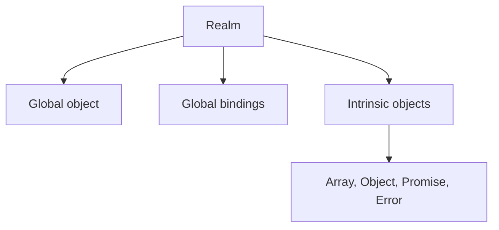

# Lesson 03 — JavaScript Realms

> **Flow:** Learn → Understand → Compare → Validate → Recall → Master

## Lesson Metadata

| Property | Value |
|---|---|
| Field | JavaScript Runtime Architecture |
| Level | Intermediate |
| Study time | 30–45 minutes |
| Prerequisites | Lessons 01–02, objects, prototypes, and `instanceof` |
| Reference | [MDN Realms](https://developer.mozilla.org/en-US/docs/Web/JavaScript/Reference/Execution_model#realms) |

## Learning Objectives

After this lesson, you should be able to:

1. Define a JavaScript realm.
2. Explain what belongs to a realm.
3. Distinguish a realm from an agent.
4. Explain why cross-realm `instanceof` checks can fail.
5. Use safer cross-realm validation.

## Lesson Overview

A **realm** is a JavaScript global environment. It contains its own global object, global bindings, and intrinsic objects.

> **A realm is JavaScript's global world.**

## What a Realm Contains

- A global object
- `globalThis`
- Global variables and functions
- Built-in constructors
- Built-in prototypes
- Intrinsic objects such as `Array`, `Object`, `Promise`, and `Error`
- Internal language caches such as tagged-template literal arrays



## Multiple Browser Realms

A main browser page has one realm. Every `iframe` has a different realm.

```text
Main-page realm
├── window
├── Array
└── Array.prototype

iframe realm
├── window
├── Array
└── Array.prototype
```

Both environments understand JavaScript, but their built-in objects have different identities.

## Cross-Realm `instanceof` Problem

```js
const iframe = document.querySelector("iframe");
const iframeArray = new iframe.contentWindow.Array(1, 2, 3);

console.log(iframeArray instanceof Array); // false
console.log(Array.isArray(iframeArray));   // true
```

`instanceof` checks whether the object's prototype chain contains the **current realm's** `Array.prototype`. The array uses the iframe realm's different `Array.prototype`, so the identity comparison fails.

```text
iframeArray
    ↓
iframe Array.prototype

instanceof checks against
    ↓
main-page Array.prototype
```

## Safer Validation

For arrays crossing realms, use:

```js
Array.isArray(value);
```

For application data, validate the actual structure instead of trusting only constructor identity:

```js
function isUser(value) {
  return Boolean(
    value &&
    typeof value === "object" &&
    typeof value.name === "string" &&
    typeof value.email === "string"
  );
}
```

In production applications, schema validators can formalize these boundaries.

## Realm vs Agent

| Concept | Responsibility |
|---|---|
| Realm | Provides a global environment and intrinsic objects |
| Agent | Executes JavaScript using stack, heap, and queues |
| Worker | Normally creates a separate agent |
| `iframe` | Creates another realm and may remain in the same agent as its parent |

One agent may own multiple realms:

```text
Browser agent
├── Main-page realm
└── Same-origin iframe realm
```

A worker normally has another agent:

```text
Main-page agent → Main-page realm
Worker agent    → Worker realm
```

## Architecture Connection

Cross-realm behavior matters when applications use:

- iframes and embedded widgets;
- browser extensions;
- testing environments;
- sandboxed plugins;
- worker communication;
- objects received from external execution contexts.

Treat data crossing a runtime boundary like API input: validate it and avoid relying entirely on prototype identity.

## Common Mistakes

- Thinking realm and agent mean the same thing.
- Assuming all windows share the same built-in constructors.
- Using `instanceof Array` for cross-frame data.
- Trusting external objects without structure or schema validation.
- Assuming same syntax means the same global environment.

## Learning by Doing

Create an HTML page containing an `iframe`. Construct an array through `iframe.contentWindow.Array`, then compare:

```js
iframeArray instanceof Array;
Array.isArray(iframeArray);
```

Document why the results differ. Then create a structural validator for a `Product` object crossing the iframe boundary.

## Active Recall

1. What is a realm?
2. What global resources belong to it?
3. Why can a real array fail `instanceof Array`?
4. Why is `Array.isArray()` safer?
5. What is the difference between an agent and a realm?
6. Can one agent contain multiple realms?
7. What architecture rule applies to cross-boundary data?

## Memorization Points

- A realm is a global JavaScript environment.
- Each realm owns its global object and intrinsic objects.
- Different realms have different prototype identities.
- One agent can own multiple realms.
- Prefer cross-realm-safe checks and explicit validation.

## Notion Card Summary

A JavaScript realm contains a global object, global bindings, and its own intrinsic constructors and prototypes. An iframe creates another realm, so objects crossing frame boundaries may fail `instanceof` identity checks. Use `Array.isArray()` and explicit structural validation for cross-realm data.

## Senior Developer Takeaway

Execution boundaries are trust boundaries. Validate data crossing iframes, workers, plugins, or external contexts. Prefer explicit contracts over assumptions about constructor and prototype identity.

## Final Summary

> **Realm defines the global world; agent executes the work.**

## Completion Checklist

- [ ] I can define a realm.
- [ ] I can list what a realm contains.
- [ ] I can distinguish realm from agent.
- [ ] I understand cross-realm `instanceof` failure.
- [ ] I can validate cross-boundary values safely.
- [ ] I completed the iframe experiment.
