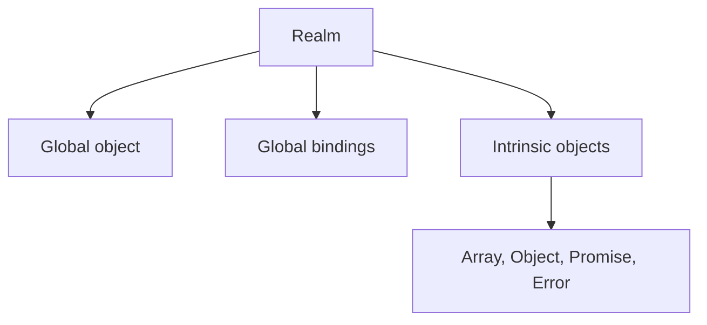

# 03 — JavaScript Realms

<div align="center">


**Understand separate global environments, prototype identity, and cross-realm validation.**

</div>

## About This Lesson

A realm is a JavaScript global environment containing its own global object, bindings, constructors, and intrinsic prototypes.

> **Realm defines the global world; agent executes the work.**

Different realms can execute the same JavaScript language while holding different built-in object identities.

## Learning Objectives

- Define a JavaScript realm.
- Identify what belongs to a realm.
- Distinguish a realm from an agent.
- Explain cross-realm `instanceof` failure.
- Validate values safely across execution boundaries.

## Material Covered

1. Global objects and `globalThis`
2. Intrinsic constructors and prototypes
3. Main-page and iframe realms
4. Cross-realm object identity
5. `instanceof` limitations
6. `Array.isArray()`
7. Realm versus agent
8. Boundary validation architecture

## Realm Model



## Multiple Realms

```text
Main-page realm
├── window
├── Array
└── Array.prototype

iframe realm
├── window
├── Array
└── Array.prototype
```

These constructors have similar behavior but different identities.

## Cross-Realm Example

```js
const iframe = document.querySelector("iframe");
const iframeArray = new iframe.contentWindow.Array(1, 2, 3);

console.log(iframeArray instanceof Array); // false
console.log(Array.isArray(iframeArray));   // true
```

`instanceof` checks the current realm's `Array.prototype`. The array was created with the iframe realm's prototype, so the identity check fails.

## Safer Boundary Validation

```js
function isUser(value) {
  return Boolean(
    value &&
    typeof value === "object" &&
    typeof value.name === "string" &&
    typeof value.email === "string"
  );
}
```

Treat data from an iframe, worker, plugin, or external context like API input: validate its structure or schema.

## Realm vs Agent

| Realm | Agent |
|---|---|
| Defines the global environment | Executes JavaScript |
| Owns globals and intrinsic objects | Owns stack, heap, and queues |
| An iframe creates another realm | A worker normally creates another agent |
| Multiple realms may share an agent | An agent may own multiple realms |

## Architecture Use Cases

- Embedded iframes and widgets
- Browser extensions
- Sandboxed plugins
- Testing environments
- Worker communication
- Cross-context data validation

## Learning Flow

```text
Identify global environment
→ Compare constructor identities
→ Reproduce instanceof failure
→ Apply safe validation
→ Separate realm from agent
→ Define the architecture boundary
```

## Memorization Points

- A realm is a global JavaScript environment.
- Each realm owns its global object and intrinsic objects.
- Prototype identity differs across realms.
- One agent can contain multiple realms.
- Cross-boundary values require reliable validation.

## Senior Developer Takeaway

Execution boundaries are trust boundaries. Use explicit schemas and safe checks instead of assuming that constructors and prototypes have universal identity.

## Mastery Checklist

- [ ] I can define a realm.
- [ ] I know what a realm contains.
- [ ] I can separate realm from agent.
- [ ] I understand why `instanceof` can fail.
- [ ] I can use cross-realm-safe validation.
- [ ] I completed the iframe experiment.

## Source Material

- [Full lesson document](../03-javascript-realms.md)
- [MDN — Realms](https://developer.mozilla.org/en-US/docs/Web/JavaScript/Reference/Execution_model#realms)

---

[← Previous lesson](../02/README.md) · [Main documentation](../README.md)
